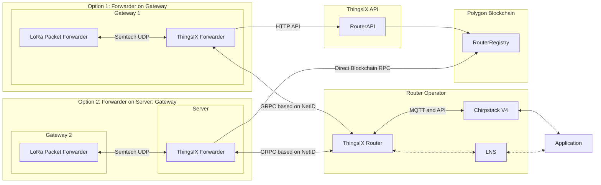

# Routing architecture

# ThingsIX Forwarder
The ThingsIX Forwarder is responsible for receiving LoRa packets from the LoRa radio via the Semtech UDP protocol. 
The forwarder can either run on the Gateway itself (Option 1) or on a Server that receives Semtech UDP traffic from multiple
LoRa gateways on the same instance of the forwarder (Option 2). This last option allows the usage of any generic
LoRa gateway that supports Semtech UDP by pointing the Lora gateway to the server that runs the ThingsIX Forwarder. 

The ThingsIX Forwarder fetches a routing-table containing the NetIDs and DevAddr-prefixes of routers that are connected to 
ThingsIX from either the ThingsIX API or directly from the blockchain. Based on this information the ThingsIX Forwarder
is able to transmit uplink packets to the right router and receive downlinks over the same router. To get this by-directional
message flow, each forwarder opens a bidirectional GRPC stream with the router it needs to connect to.

To route Join-packets the Forwarder periodically requests a Xor16-filter containing the DevEUIs of the devices that need
to join a certain Router. 

# ThingsIX Router
The ThingsIX Router is responsible for receiving LoRa packets that are forwarded by ThingsIX Forwarders. It in turn forwards
the packets to the Network Server. Currently Chirpstack v4 is supported by the ThingsIX Router. As Chirpstack v4 uses MQTT
for exchanging packets, the ThingsIX Router uses MQTT to transmit and receive packets from Chirpstack. Additionally the
Router uses the Chirpstack API to get the DevEUIs of the connected devices. 