# Setting up a Forwarder on a VPS


:::caution Disclaimer
Following this tutorial will cost you money as the VPS-provider will charge you for the resources used. 
:::

The ThingsIX Forwarder can either run on the LoRa gateway itself (not supported by all gateways) or can be run on a virtual server in the cloud (often called a VPS) to support multiple LoRa gateways. In this tutorial we are going to set-up a ThingsIX Forwarder on a VPS to be used by one or more LoRa gateways.

## Picking a VPS supplier


In this example we are using DigitalOcean. By using [this referral link to DigitalOcean.com](https://m.do.co/c/aaa0eb7d5c9e) you get 200$ of free credit valid for 60 days, this should be more enough to follow this tutorial for the first 60 days that the credit is valid for. Of course you can also go directly to [DigitalOcean.com](https://www.digitalocean.com) and setup an account. To set-up an account click to sign-up using your Github.com account, Google-account or using E-mail and Password. You will need to provide a credit-card.


If you don't like DigitalOcean, you can also consider alternatives like [Hetzner Cloud](https://www.hetzner.com/cloud). While the steps to create the VPS will be different, the rest of the tutorial will be exactly the same. 

## Creating the project

Click 'Create Project' to create a new project so we can separate the ThingsIX forwarder from the rest of your VPS-es. 


Fill in some details (you can enter whatever you want)
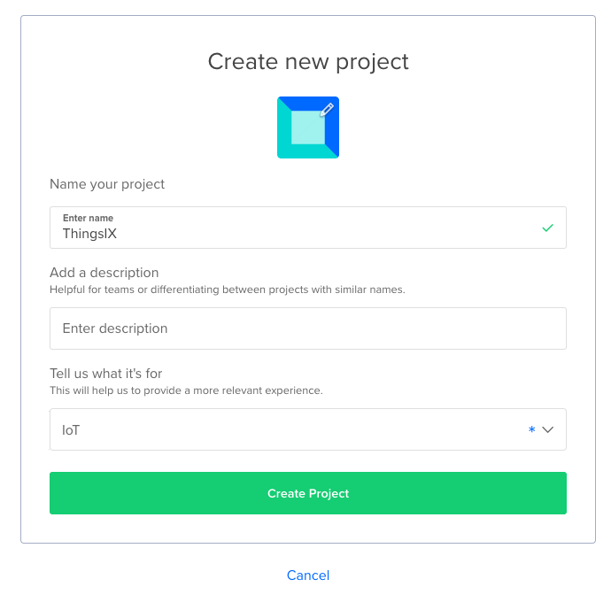

And skip moving resources on the next page

## Create the VPS
Now it's time to create the VPS (or 'Droplet' as it's called at DigitalOcean).

First click the 'Get started with a Droplet button':

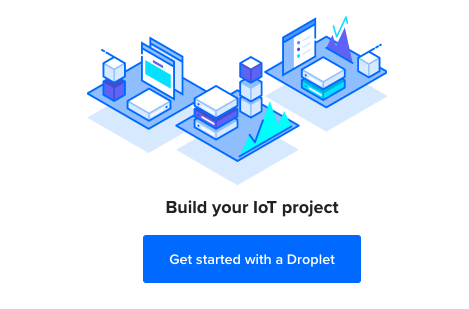

Now select a location that is geographically close to your LoRa gateways as LoRa and ThingsIX is latency sensitive. (tip: if you have gateways around the world you can create multiple instances in different locations). We pick Amsterdam for this tutorial but don't copy it 1:1 if you are not near to Amsterdam.

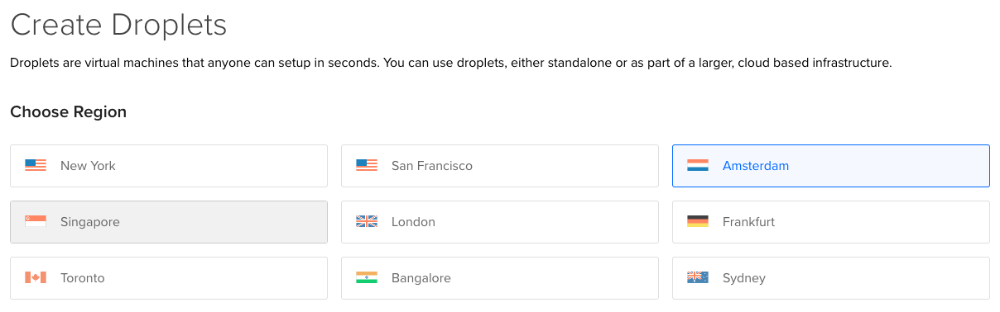

Also select a datacenter. This doesn't really matter but as you will see in the next step, not every datacenter supports the smallest VMs/Droplets, so you might want to switch.

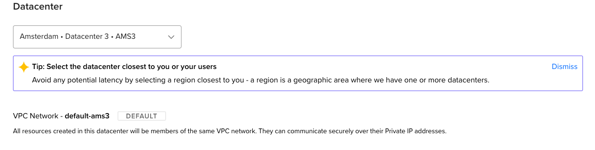

For the image select 'Ubuntu' and select '22.04 (LTS) x64':

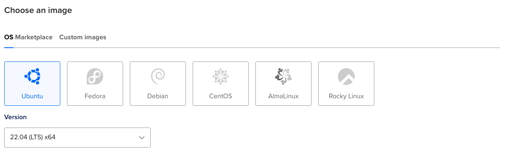

For the size you can select one of the '512MB' or '1GB' plans under basic. This should be enough up to 50-100 gateways (depending on traffic)

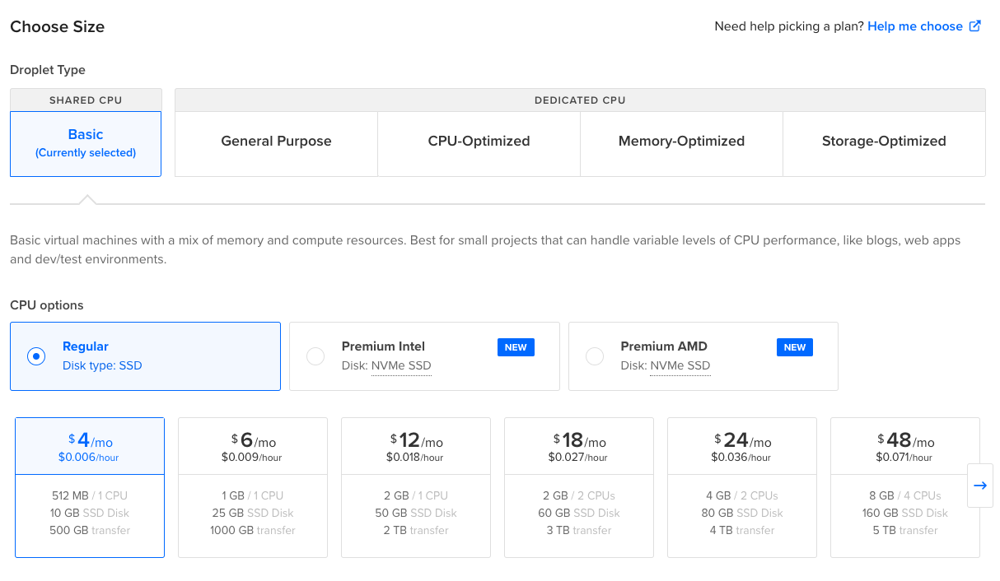

Now scroll down and create a password for the `root` user. Make sure to pick a secure password and don't share it. (Tip: setting up a SSH-key is even better, but for the simplicity of this tutorial this is skipped).

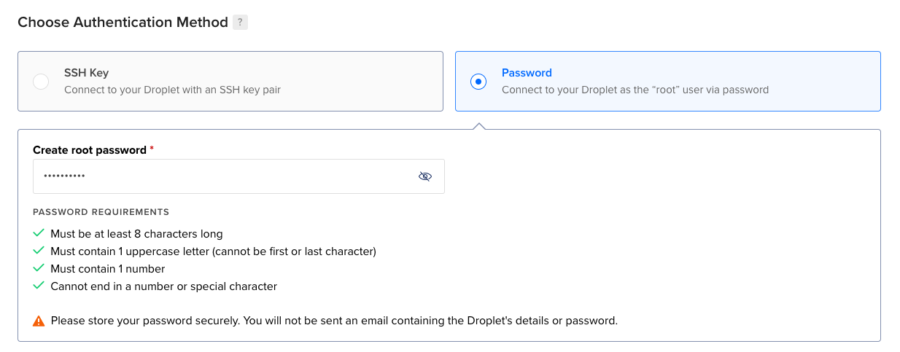

Set a hostname that allows you to identify this server later on:

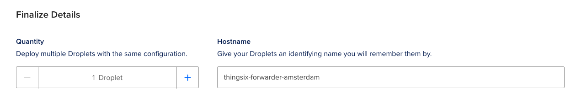

Now it's time to create the VPS by clicking 'Create Droplet'. 

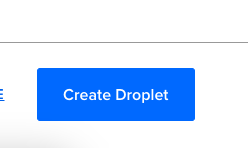

Now we wait a little until the creation of the VPS is finished:

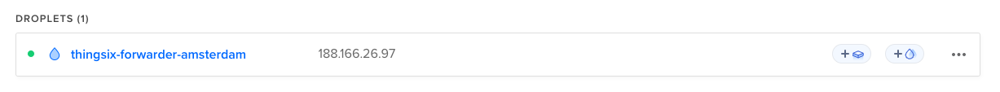

Keep note of the IP-address of your VPS (`188.166.26.97` in this example, yours will be different!). Optionally you can use DNS to give it a resolvable hostname. Now click on the VPS name.

## Setting up the ThingsIX Forwarder software

 To simplify this tutorial we are using the web console that DigitalOcean offers to connect to SSH. However you can also use your own SSH client like Putty on Windows or the built-in `ssh` on MacOS and Linux. 

 Now connect to the VPS by using either the console button

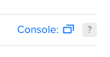

 or by using SSH to the IP with the 'root' user:
```bash
ssh root@188.166.26.97
```
and enter the password you configured earlier. Note that the IP will be different in your case!

Now first install docker-engine. We are using the non-interactive quick-install for this here. Paste the following command in the console and hit enter:
```bash
curl -fsSL https://get.docker.com -o get-docker.sh
```
Now run the command by entering:
```bash
sh ./get-docker.sh
```
This will take a while and install docker-engine. Once it's finished you will see output like:
```bash
================================================================================

To run Docker as a non-privileged user, consider setting up the
Docker daemon in rootless mode for your user:

    dockerd-rootless-setuptool.sh install

Visit https://docs.docker.com/go/rootless/ to learn about rootless mode.


To run the Docker daemon as a fully privileged service, but granting non-root
users access, refer to https://docs.docker.com/go/daemon-access/

WARNING: Access to the remote API on a privileged Docker daemon is equivalent
         to root access on the host. Refer to the 'Docker daemon attack surface'
         documentation for details: https://docs.docker.com/go/attack-surface/

================================================================================
```

Now make the directory that will contain all the thingsix-forwarder related files by entering:

```bash
mkdir /etc/thingsix-forwarder
```

Next we can actually start the ThingsIX forwarder as docker container. First go to the [the forwarder docker repository](https://github.com/ThingsIXFoundation/packet-handling/pkgs/container/packet-handling%2Fforwarder) and take note of the latest version (for example `1.0.3` at the time of writing).

Now think of a random number under the 10000 to be used as port-number for the ThingsIX forwarder (we are using 5652 here). This will be the port number where LoRa gateways will send the received packets. 

Now run the ThingsIX Forwarder (remember to replace `1.0.3` with the latest version number and `5652` with the port number you have picked)
```bash
docker run -d -p 5652:1680/udp --restart unless-stopped -v /etc/thingsix-forwarder:/etc/thingsix-forwarder --name thingsix-forwarder ghcr.io/thingsixfoundation/packet-handling/forwarder:1.0.3
```

This will give an output like:
```
Status: Downloaded newer image for ghcr.io/thingsixfoundation/packet-handling/forwarder:1.0.3
ed46e7ca7c6e1f329f9c4928e38c9bf23a660de8a44b5f62f2312ee9468507db
```

Now secure your VPS by enabling the firewall.

First enter to allow SSH traffic
```bash
ufw allow ssh
```

Next enter to allow LoRa packets to be delivered. Remember to replace the port number with the port number you picked.
```bash
ufw allow 5652/udp
```

Now enable the firewall:
```bash 
ufw enable
```

This will give a warning like:
```bash
Command may disrupt existing ssh connections. Proceed with operation (y|n)? 
```
You can enter `y` to continue.

**Congratulations!** Your ThingsIX Forwarder is now ready to receive packets from LoRa gateways. 

Now login to your preferred LoRa gateway and configure it to forward packets to the IP of your VPS. Use the port number you selected. Most gateways offer a web-interface to do this. Ask your vendor if you can't find it. 

Remember: You can use the VPS for many gateways, no need to create a new one for each gateway.

If you are using the Semtech `packet_forwarder` directly you want to change the following configuration (your values will be different!): 
```json
    "gateway_conf": {
        "server_address": "188.166.26.97",
        "serv_port_up": 5652,
        "serv_port_down": 5652,
```
(the `packet_forwarder` needs a restart to pick-up new configurations).

Now monitor the logs of your packet forwarder by running:
```bash
docker logs thingsix-forwarder
```

You should see something in the logs like:
```bash
time="2022-12-20T09:50:44Z" level=info msg="unknown gateway recorded" file=/etc/thingsix-forwarder/unknown_gateways.yaml gw_local_id=ac1f09fffe06092c
``` 
Make sure you recognize all the gateway-ids, also called 'gateway EUI'. (The id/EUI is usually printed on the label of a LoRa gateway or provided in the web interface).

You can import the gateways by running:
```bash
docker exec thingsix-forwarder ./forwarder gateway import 0 0x0 0x0
```

This should give an output like: 
```bash
msg="imported 1 gateways, don't forget to onboard these with the above JSON message"
```
You can ignore the part about onboarding for now. 

Everything is now ready to forwarder packets on ThingsIX! 

## Auto-updating ThingsIX Forwarder
You can use [Watchtower](https://containrrr.dev/watchtower/) to auto-update the ThingsIX Forwarder docker image by running:
```bash
docker run -d \
--name watchtower \
-v /var/run/docker.sock:/var/run/docker.sock \
containrrr/watchtower
```

Of course you can also manually update the ThingsIX Forwarder by running:
```bash
docker rm -f thingsix-forwarder
``` 
to delete the forwarder docker-container (don't worry the data won't be deleted) and then restart it again with the newer version by using the original run command again (of course with the updated version number):
```bash
docker run -d -p 5652:1680/udp --restart unless-stopped -v /etc/thingsix-forwarder:/etc/thingsix-forwarder --name thingsix-forwarder ghcr.io/thingsixfoundation/packet-handling/forwarder:1.0.4
```
Don't forget to replace `5652` with the port-number you picked!