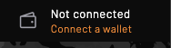
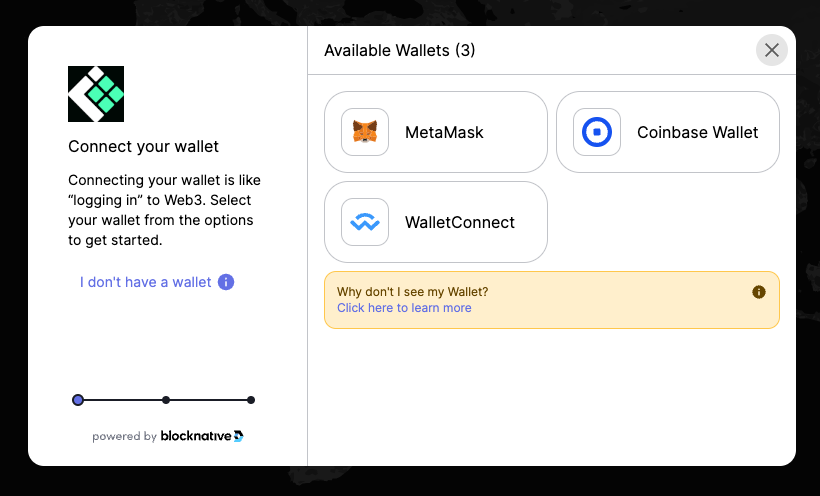
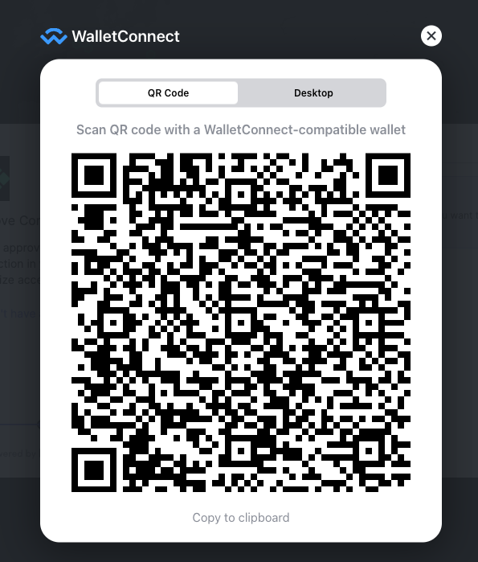
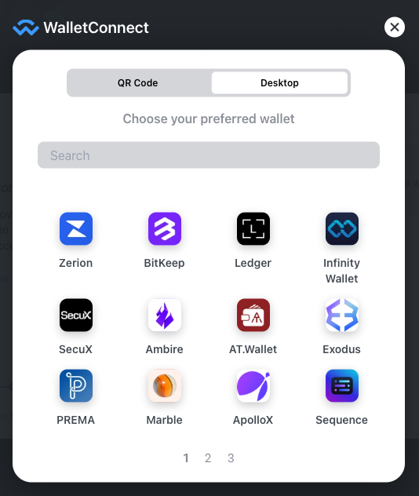

# Connecting a Polygon Wallet

## Wallet requirements
Before you can start registering your gateways and earn rewards you will need to
setup your wallet. With this wallet you will manage your gateways and receive
earned rewards. You will require a wallet that:
- support the Polygon (MATIC) network
- supports ERC-20 tokens and contract interactions
- contains Polygon MATICs to pay for transaction fees

## Prepare wallet

### Matics
ThingsIX is build on the Polygon blockchain. Polygon uses the MATIC token to pay
for transaction fees. MATICs can be bought and obtained through various exchanges. 

Please make sure you select the Polygon network when withdrawing MATICs.

### THIX
Next step is to obtain THIX tokens. You can either retrieve this by claiming rewards (if you received any) or by exchanging them via a exchange. 

TODO: Rewards claim page
TODO: Swap page

## Connecting wallet

To be able to interact with the smart-contracts of the ThingsIX network you will need a Polygon Wallet. Because of Web3 standards that are used by ThingsIX and the ThingsIX web-app, a lot of wallets are supported. 

To start connecting your wallet, click the `Connect a wallet` button in the top-right corner:

Here you get an option to select the wallet you are using:

MetaMask and Coinbase Wallet are two popular options, other popular options such as Ledger support can be find by clicking WalletConnect:

Desktop apps like the Ledger Live app can be found by clicking on `Desktop`:

You will be taken to the selected wallet and have to follow the wallet specific options. Please note that some wallets don't "pop-up" and you have to open them manually (also while doing transactions).

The dashboard currently supports [Metamask](https://metamask.io),
[Coinbase Wallet App](https://www.coinbase.com/wallet) and any wallet that can
be connected with [WalletConnect](https://walletconnect.com) and satisfies the
above stated requirements.

