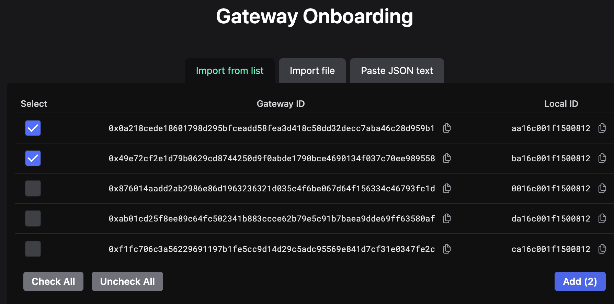
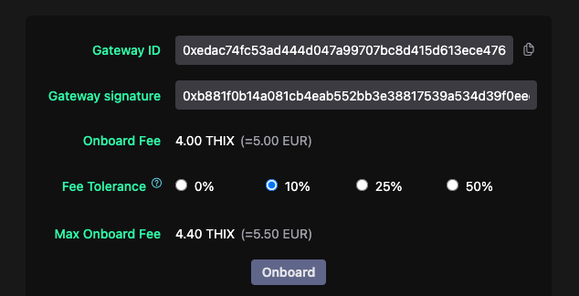
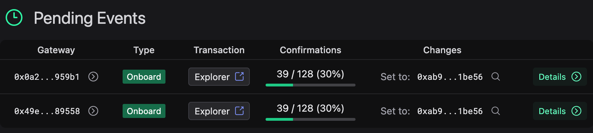
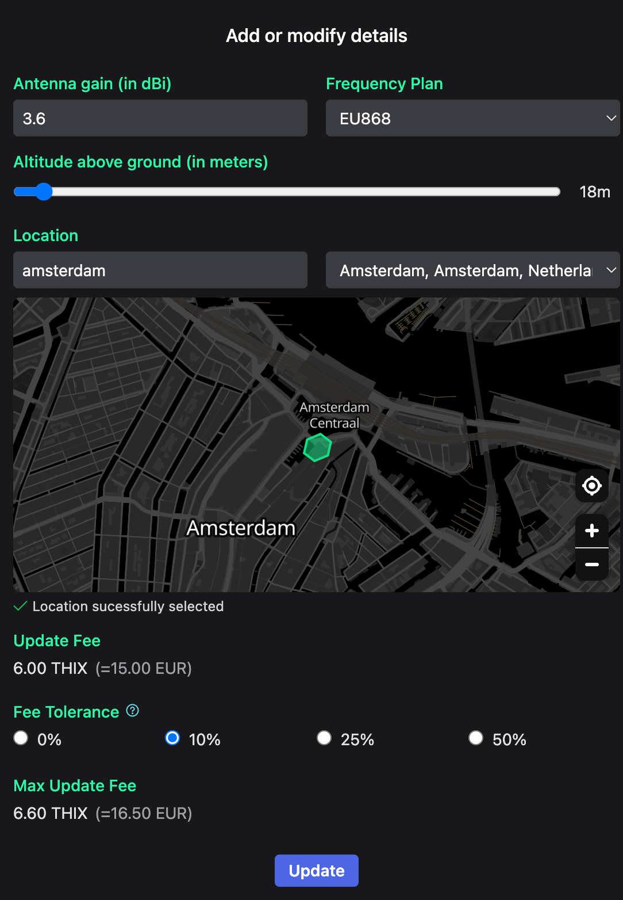
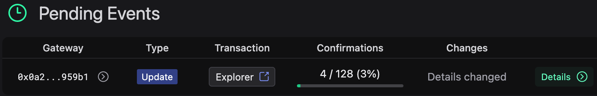

# Introduction
Before a gateway is operational in ThingsIX it must be onboarded and its owner
must set details such as antenna gain and location. The ThingsIX webapp
provides a method to perform these operations.

The web app is available at [https://app.thingsix.com](https://app.thingsix.com)

## Connecting Wallet

First make sure to connect a wallet. Instructions can be found here: [Connecting a Wallet](./connecting-wallet.md)

## Onboard gateway
Open in the top menu the Gateway -> Onboard page. When you created the gateway
onboard message with the ThingsIX forwarder and opted to push the onboard
message to ThingsIX you will be presented with a list of pending gateway onboard
messages. From this list select the gateways that you want to onboard and click
on the add button.

The dashboard will now prepare a gateway onboard transaction
that you can submit with the onboard gateway button. You wallet will now ask
for confirmation and once approved submits the gateway onboard transaction onto
the network. Once processed your gateways are onboarded on ThingsIX into your
personal wallet.

If you opted not to send the onboard messages to ThingsIX you can paste the
generated onboard message manually.

After your gateway onboard transaction is processed you can go to the `Gateways`
-> `Overview` page. You will now see a pending gateway onboard event. We require
128 block confirmations before your onboard is accepted. During these 128 blocks
your onboard transaction is considered pending.

### Gateway onboard fee
Onboarding a gateway requires the user to pay a fee. This fee is set in EUR
but paid with THIX tokens. With a THIX/EUR exchange rate the amount of THIX
tokens are calculated. When the onboard is successful the THIX tokens that paid
for the fee are burned and taken out of circulation.

Initial batches of the ThingsIX Mappers include a free onboard that doesn't require any THIX. You can't onboard multiple gateways at once when using the free onboard.

After you filled in the form with the values from the onboard message that you
obtained from the forwarder the form will show the current fee. Because the
THIX/EUR exchange rate updates frequently there is a change that the calculated
amount of THIX tokens to pay for the fee isn't enough at the moment that the
transaction is processed causing your onboard transaction to fail.

Therefore the form offers you a method to set the max fee that you are willing to pay. It is guaranteed
that you never pay more than max fee. If max fee is higher than the onboard fee
at the moment the transaction is processed you will only pay for the current
onboard fee.

After you press the `Onboard` button your wallet will ask you to sign the
onboard transaction. Once the transaction is processed navigate to the gateways
overview page through the menu `Gateways` -> `Overview`. You will now see a
pending gateway onboard event. We require 128 block confirmations before your
onboard is accepted.

After 128 blocks the onboard is confirmed and you will see the gateway listed in
the `Onboarded gateways` list. You have now successfully onboarded your gateway.

## Set gateway details
The last step to do before your gateway is operational is to set its details.

Click on the `Details` button in the last column of the gateway. This will take
you to the details page of the gateway. If the gateway is owned by the connected
wallet the dashboard shows several buttons on the right. With the `edit` button
you can set the details of the gateway and the `transfer` button allows you to
send the gateway to a different wallet.

Click on the `edit` button. A form opens that allows you to specify the gateway
specific settings. The frequency plan is automatically derived from the location
that you picked. Make sure to zoom in maximal when selecting the location. The
update fee has the same problem as the onboard fee that the THIX/EUR exchange
rate can change. Therefore you can set the max fee you are willing to pay here
as well.

:::info
Pay good care when setting these details. They are used in the coverage mapping
process. If not correct you risk that mapping your gateway fails and your
gateway won't be able to earn rewards.
:::

Once the transaction is confirmed you will see the pending gateway update event
on the gateway overview page. ThingsIX requires 128 blocks before the update is
accepted. Once accepted your gateway is ready to use.

The next time you navigate to the gateway details page you will see the entered
values.