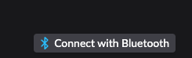
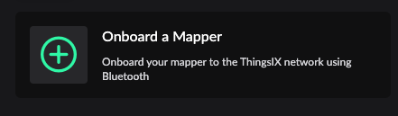
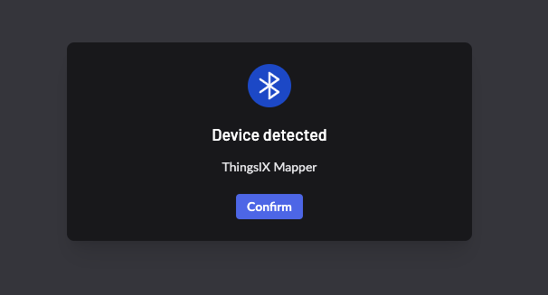
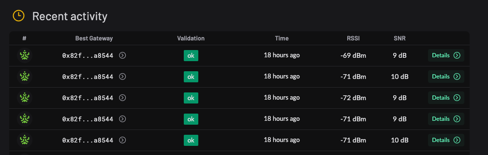

# Getting Started with the ThingsIX Mapper

## Charging
The ThingsIX Mapper has a USB-C connection that can be used for both powering the mapper and charging the mapper. Use a charger that can supply 2 Amps or more for a reliable charging and operating experience. 

It's ok to leave the mapper connected while mapping. 

## LED and Button
The ThingsIX Mapper has a multi-color LED that shows it's status. Depending on the state it's in, multiple patterns are visible:

| Pattern                                    | State                           | Description                                                                                                                        |
|--------------------------------------------|---------------------------------|------------------------------------------------------------------------------------------------------------------------------------|
| Off                                        | Off                             | The battery of the mapper is empty and the mapper is not connected to a power supply                                               |
| Green Blinking                             | Getting GNSS Fix and Validation | The mapper is trying to get a GNSS (GPS, Galileo) location fix and is validating the signals from the GNSS satellites              |
| Blue Blinking (combined with other states) | Bluetooth On                    | The bluetooth interface of the mapper is on, and the mapper can be discovered and connected to over Bluetooth LE.                  |
| Green Solid                                | Ready to map                    | The mapper is ready to map and will automatically transmit mapping packets                                                         |
| White Solid                                | Found Gateway                   | The mapper has interacted with a gateway in last second.                                                                            |
| Red Blinking                               | Initializing or error           | The mapper is just powered on or has an fatal error. This state should disappear after powering on after a few seconds, if not there's a fatal error. |
| White Breathing/                            | Sleep and not charging/powered  | The mapper is sleeping and is not charging the battery                                                                             |
| Green Breathing                            | Sleep and charged               | The mapper is sleeping and is fully charged                                                                                        |
| Red Breathing                              | Sleep and charging              | The mapper is sleeping and is charging                                                                                             |

Using the button next to the USB-C connector, the state of the mapper can be changed:

- Short press (less than 10 seconds pressed): Enable/disable Bluetooth
- Long press (between 10 and 60 seconds pressed): Enable/disable sleep
- Very long press (longer than 60 seconds): Reboot mapper

## Onboarding Mapper

Using the Bluetooth interface the Mapper can be connected to your Polygon account. First make sure that your computer you are using has Bluetooth LE 4.2 or higher support as it's needed to connect to the ThingsIX Mapper.

To do so, go to the ThingsIX web app at: [https://app.thingsix.com](https://app.thingsix.com)

Next follow the instructions to connect your wallet to the app: [Connecting a Wallet](../for-gateway-owners/connecting-wallet.md) and make sure you have some MATIC.

Once your wallet is ready, shortly press the button on the Mapper itself to turn on bluetooth. Verify that the LED is blinking blue to indicate that Bluetooth is turned on.

Now go to the Mapper section of the ThingsIX web app and click the `Connect with Bluetooth` button:

Now click the `Onboard a Mapper` button:

You will now be asked by your browser to select and connect to a bluetooth device. Find the device called `ThingsIX Mapper` and click `Pair` or `Connect` (depending on browser). You should now see a window confirming that the ThingsIX Mapper was detected:

Now click `Confirm` and switch to your wallet and follow the instructions to sign the transaction using your wallet.

The ThingsIX App will now show the confirmation process of the registration transaction. After 128 blocks the Mapper is ready to use! 

## Mapping using the ThingsIX Mapper

The ThingsIX Mapper is used to measure the signal strength that Gateways connected to ThingsIX are providing at a location. Such measurement executed at a certain location is called a "Mapping Record". If no Gateway is within reach, no Mapping Record will be created. The gateway providing the strongest signal (confirming to certain validation checks) is determined to provide the best coverage at that location.

You can view recent Mapping Records on the mapper detail page under `Recent activity`:
.

Please note that due to privacy reasons the Mapping Records are delayed by 1 hour. In other words you won't see the mapping records that happened in the last hour. In a future update we will provide a way to view recent records behind authentication. 

If you click on one of the Mapping Records you can see the details. For more information about mapping validation rules see: TODO 

